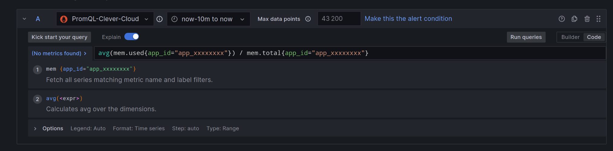

# Setting Up a Grafana Alert with Telegram/Discord Notifications

This guide explains how to configure a Grafana alert based on an application's RAM usage and send notifications via Telegram or Discord.

## Prerequisites
- Access to Grafana with the necessary permissions to create alerts.
- A Telegram or Discord channel configured to receive notifications.

## Configuration Steps

### Connecting to Grafana
Log in to your Grafana instance and navigate to the **Metrics in Grafana** tab of your organization.

### Configuring Notifications
1. Go to the **Notifications** tab.
2. Add a Telegram or Discord notification channel:
   - **[Telegram Notifications](https://grafana.com/docs/grafana/latest/alerting/configure-notifications/manage-contact-points/integrations/configure-telegram/)**:
     1. Create a Telegram bot via [@BotFather](https://t.me/BotFather).
        1. (Search => @BotFather)
     2. Obtain the bot **TOKEN** and add the bot to a Telegram group.
        1. Type `/newbot`
        2. Choose a name and username. It must end in `bot` or `_bot`. E.g., `my_bot`.
        3. Copy the API token.
     3. Retrieve the group chat ID using the Telegram API.
        1. To get the `chat_id`, modify the following URL with `{your_bot_api_token}`:
        ```sh
        https://api.telegram.org/bot{your_bot_api_token}/getUpdates
        ```
        2. If successful, the response should be in JSON format:
        ```sh
        ...
        "chat": {
                "id": -4065678900,
                "title": "Tony and Hello world bot",
                "type": "group",
        ...
        ```
     4. Configure Grafana to send notifications to this chat:
        1. Toggle the side menu and navigate to `Alerting` > `Contact points`.
        2. Click `+ Add contact point`.
        
        3. Name the contact point, e.g., `telegram-notification`.
        4. Under `Integration`, select `Telegram`.
        5. Enter your Telegram credentials: bot API token and chat ID.
        6. Click `Test` to verify the integration. If it fails, double-check your credentials.
        7. Click `Save contact point`.
   - **[Discord Notifications](https://grafana.com/docs/grafana/latest/alerting/configure-notifications/manage-contact-points/integrations/configure-discord/)**:
     1. In your Discord server, create a new channel.
     2. Click `Edit Channel` > `Integrations` > `New Webhook`.
     3. Create a webhook and copy the URL:
     ```sh
     https://discord.com/api/webhooks/{123456789}/{123456789azerty}
     ```
     4. Add the webhook URL to Grafana's notification settings:
        1. Toggle the side menu and navigate to `Alerting` > `Contact points`.
        2. Click `+ Add contact point`.
        3. Name the contact point, e.g., `discord-notification`.
        4. Under `Integration`, select `Discord`.
        5. Enter your credentials: `Webhook URL`.
        6. Click `Test` to verify the integration. If it fails, double-check your credentials.
        7. Click `Save contact point`.

### Creating the Alert
1. Click the **+** button and select **Create alert rule**.

2. You will be redirected to the alert creation page.

### Configuring the Query and Alert Condition
1. Set an alert rule name.
2. In the first box (**Set a query and alert condition**), select **Code**.
  * Example: Enter the following formula to get the average RAM usage of your application:
   ```
   avg(mem.used{app_id="app_xxxxxxxx"}) / mem.total{app_id="app_xxxxxxxx"}
   ```
   
3. In the second box **Reduce**, select:
   - **Function:** Min
   - **Input:** A
   - **Mode:** Strict
4. In the third box **Threshold**, set the following condition:
   - **Input B IS BELOW 0.15** (below 15%)

### Configuring Alert Evaluation Behavior
1. **Folder:** Select the folder where the alert will be saved.

2. **Evaluation group:** Set the measurement interval.
   - **Evaluate every:** 15m
   - **For:** 90d (90 days)

### Adding Additional Details
You can add extra details to help understand the alert when triggered.

### Configure the notification policy
Now that we’ve tested that the connection works, we will add this contact point to our notification policy.
1. In Grafana’s sidebar, navigate to Notification policies
2. Under Default policy, click the **ellipsis icon (…)**
3. Click Edit
4. Change the Default contact point to `telegram`or `discord`

### Saving and Activating the Alert
Once all configurations are complete, click **Save** to store the alert.

## Verification and Testing
- Ensure the alert appears in your Grafana alert list.
- Simulate a RAM drop to test notification delivery.

## Conclusion
Your Grafana alert is now set up to monitor your application's RAM usage and send notifications when the critical threshold is reached.
